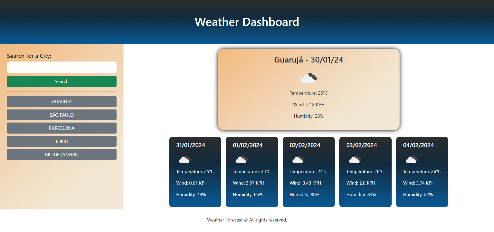

# Weather-Dashboard

## Overview

This project is a weather dashboard that allows users to check the current and future weather conditions for multiple cities. It utilizes the OpenWeatherMap API to fetch weather data based on geographical coordinates. The application features dynamically update HTML and CSS, providing users a user-friendly interface to plan their trips according to the weather outlook.

## Resources

[geeksforgeeks.org](https://www.geeksforgeeks.org/how-to-remove-duplicate-elements-from-javascript-array/): Removing duplicate elements from arrays.

[w3schools](https://www.w3schools.com/jquery/event_ready.asp): jQuery ready method.

[Ranjan-Beginner's Guide](https://www.youtube.com/watch?v=QEu8_5bYm-w&ab_channel=Ranjan-Beginner%27sGuide): Working with the 5 days weather forecast api.

[CSS Gradient](https://cssgradient.io/): To set gradient background colours.

[CSS Generator](https://cssgenerator.org/): To generate nice shadow effects.

## Instructions

1. Enter the city name for which you want to check the weather in the search input.
2. Upon searching, the dashboard will display current and future conditions for the specified city.
3. The current weather conditions include:

- City name
- Date
- Icon representation of weather conditions
- Temperature
- Humidity
- Wind speed

4. The 5-day forecast includes:

- Date
- Icon representation of weather conditions
- Temperature
- Humidity

5. The searched city is added to the search history.
6. Clicking on a city in the search history will display current and future conditions for that city again.

## Technologies Used

[Day.js](https://day.js.org/docs/en/display/format): Used for handling date and time operations.

[OpenWeather](https://openweathermap.org/price): Api for Weather Forecast data.

[jQuery](https://jquery.com/): Used for dynamically updating HTML and CSS.

[Bootstrap](https://getbootstrap.com/): Used for enhancing the overall design and layout.

## To Access

[View this Weather Forecast Dashboard App](https://rober-web.github.io/Weather-Dashboard/)
